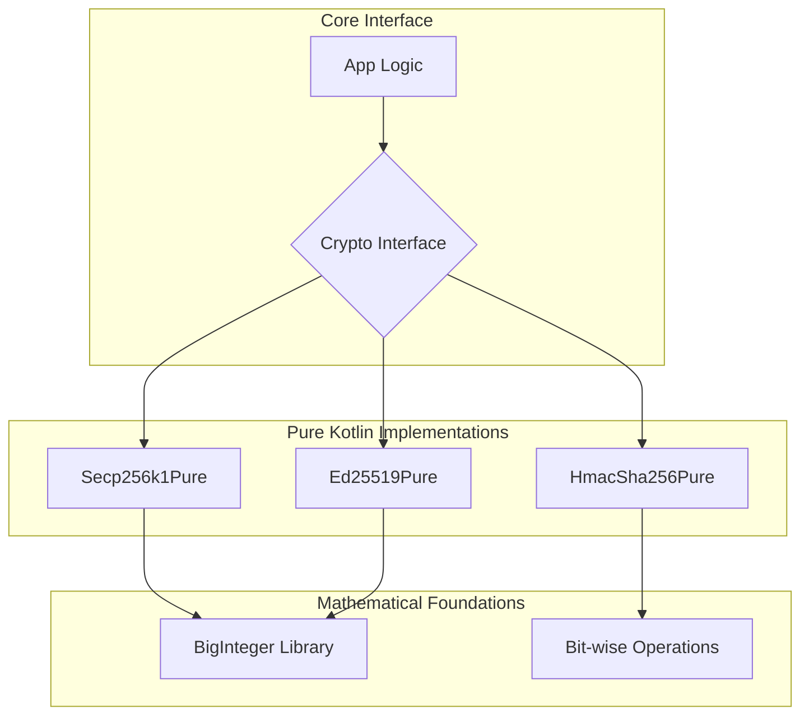

# kotlin-crypto-pure

<p align="center">
  
</p>

<p align="center">
  <a href="https://jitpack.io/#ImL1s/kotlin-crypto-pure"></a>
  <a href="#"></a>
  <a href="#"></a>
  <a href="#"></a>
</p>

<p align="center">
  <strong>💎 Zero-dependency Pure Kotlin Cryptography Primitives.</strong>
</p>

---

## 🏗️ Architecture



---

## ✨ Features

- **Secp256k1**: Complete pure Kotlin implementation of Elliptic Curve Cryptography.
- **Ed25519**: Support for Edwards curves (Solana, Cardano).
- **Hmac-Sha256**: High-speed, bit-perfect HMAC implementation.
- **Zero Native Dependencies**: No cinterop, no `.a` or `.so` files—just Kotlin.
- **Portable**: Works on any platform that runs Kotlin.

---

## 📦 Installation

```kotlin
// build.gradle.kts
implementation("com.github.ImL1s:kotlin-crypto-pure:0.3.0-watchos")
```

---

## 🚀 Usage

### Sign with Secp256k1
```kotlin
val privKey = Random.nextBytes(32)
val message = "Hello KMP".toByteArray()
val signature = Secp256k1Pure.sign(message, privKey)

val isValid = Secp256k1Pure.verify(message, signature, pubKey)
```

---

## 📄 License
MIT License
