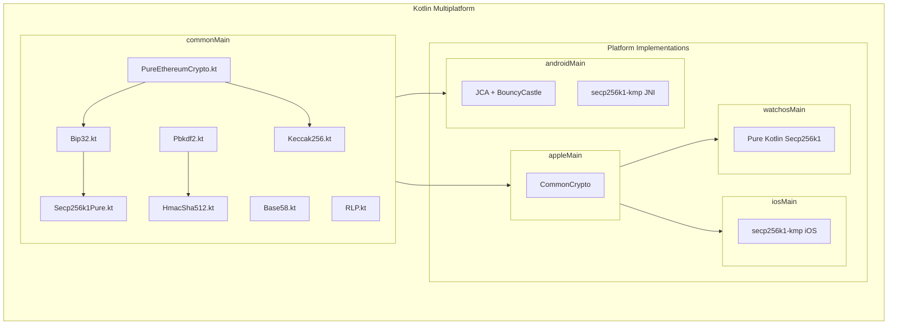
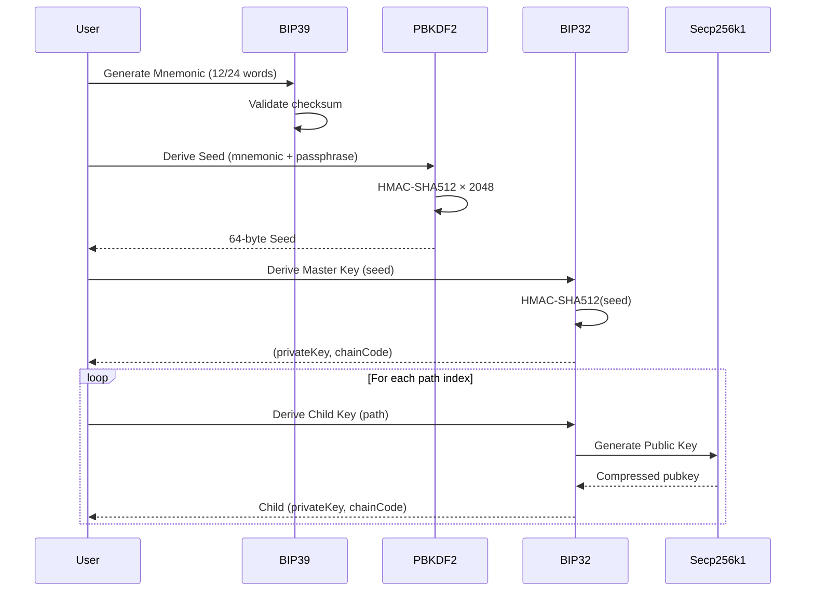

# kotlin-crypto-pure

<p align="center">
  
</p>

<p align="center">
  <a href="#"></a>
  <a href="#"></a>
  <a href="LICENSE"></a>
</p>

<p align="center">
  <strong>🔐 The first complete pure Kotlin cryptography library for wearable wallets.</strong>
</p>

<p align="center">
  A Kotlin Multiplatform library implementing BIP32, BIP39, and secp256k1<br>
  <strong>without any native dependencies</strong>. Designed for watchOS, wearOS, and any Kotlin environment.
</p>

---

## ✨ Features

| Feature | Description |
|---------|-------------|
| **BIP39** | Mnemonic generation, validation, and seed derivation |
| **BIP32** | HD wallet key derivation (both private and public) |
| **Secp256k1** | Pure Kotlin ECDSA signing, verification, and ECDH |
| **BIP340** | Schnorr signatures and Public Key Tweaking (Taproot) |
| **PBKDF2** | HMAC-SHA512 with 2048 iterations (BIP39 compliant) |
| **AES-GCM** | Authenticated encryption |
| **Hashing** | SHA256, SHA512, Keccak256, RIPEMD160 |
| **Encoding** | Base58, Bech32, Bech32m, RLP |
| **Blockchain**| Solana, Tron, Ethereum, Bitcoin |

---

## 🏗️ Architecture



---

## 🔄 Key Derivation Flow



---

## 🎯 Target Platforms

| Platform | Implementation | Status |
|----------|----------------|--------|
| **Android** | JCA + secp256k1-kmp (JNI) | ✅ |
| **iOS** | CommonCrypto + secp256k1-kmp | ✅ |
| **watchOS** | CommonCrypto + Pure Kotlin Secp256k1 | ✅ |
| **wearOS** | Via Android target | ✅ |

---

## 📦 Installation

### Gradle (Kotlin DSL)

```kotlin
// settings.gradle.kts
dependencyResolutionManagement {
    repositories {
        mavenCentral()
    }
}

// build.gradle.kts (common source set)
kotlin {
    sourceSets {
        commonMain.dependencies {
            implementation("io.github.iml1s:kotlin-crypto-pure:1.1.0")
        }
    }
}
```

---

## 🚀 Quick Start

### Generate a Mnemonic & Seed

```kotlin
import io.github.iml1s.crypto.Pbkdf2

// Generate seed from mnemonic (BIP39)
val mnemonic = "abandon abandon abandon abandon abandon abandon abandon abandon abandon abandon abandon about"
val seed = Pbkdf2.bip39Seed(mnemonic, passphrase = "")

// seed is now a 64-byte ByteArray ready for BIP32 derivation
```

### HD Key Derivation (BIP32)

```kotlin
import io.github.iml1s.crypto.Bip32

// Derive master key from seed
val masterKey = Bip32.derivePath(seed, "m")

// Derive Ethereum account (BIP44)
val ethKey = Bip32.derivePath(seed, "m/44'/60'/0'/0/0")

// Get private key and chain code
val privateKey = ethKey.privateKey  // 32 bytes
val chainCode = ethKey.chainCode    // 32 bytes
```

### ECDSA Signing (Secp256k1)

```kotlin
import io.github.iml1s.crypto.Secp256k1Pure

// Generate public key from private key
val publicKey = Secp256k1Pure.generatePublicKey(privateKey)

// Sign a message hash (32 bytes)
val signature = Secp256k1Pure.sign(messageHash, privateKey)

// Verify signature
val isValid = Secp256k1Pure.verify(messageHash, signature, publicKey)
```

### Schnorr Signing (BIP340)

```kotlin
// Tweak public key for Taproot (e.g., Q = P + H(P|c)G)
// If merkleRoot is null, it's a key-path spend
val outputKey = Secp256k1Pure.pubKeyTweakAdd(publicKey, tweak)

// Sign using Schnorr
val auxRand = ByteArray(32) // Optional auxiliary entropy
val signature = Secp256k1Pure.schnorrSign(messageHash, privateKey, auxRand)

// Verify Schnorr signature
val isSchnorrValid = Secp256k1Pure.schnorrVerify(signature, messageHash, outputKey)
```

### Ethereum Address Derivation

```kotlin
import io.github.iml1s.crypto.PureEthereumCrypto

// Derive address from private key
val address = PureEthereumCrypto.deriveAddressFromPrivateKey(privateKey)
// Returns: "0x9858EfFD232B4033E47d90003D41EC34EcaEda94"
```

### Solana Address & KeyPair

```kotlin
import io.github.iml1s.crypto.Solana

// Generate new random KeyPair
val keyPair = Solana.generateKeyPair()
val privateKey = keyPair.privateKey // 32 bytes seed
val publicKey = keyPair.publicKey   // 32 bytes

// Get Address (Base58 encoded public key)
val address = Solana.getAddress(publicKey)
```

### Tron Address Generation

```kotlin
import io.github.iml1s.crypto.Tron
import io.github.iml1s.crypto.Secp256k1Pure

// Generate public key first
val publicKey = Secp256k1Pure.generatePublicKey(privateKey)

// Get Tron Address (Base58Check with '41' prefix)
val tronAddress = Tron.getAddress(publicKey)
// Returns: "T..."
```

---

## 🛡️ Security

### Verified Against Standard Test Vectors

| Standard | Source | Status |
|----------|--------|--------|
| **BIP39** | Official Trezor vectors | ✅ |
| **BIP32** | Test Vectors 1, 2, 3 | ✅ |
| **Secp256k1** | Wycheproof edge cases | ✅ |
| **RFC 6979** | Deterministic signatures | ✅ |

### Secure Memory Handling

```kotlin
// Automatic cleanup of sensitive data
Secp256k1Pure.sign(message, privateKey)  // k value is securely wiped after use

// SecureByteArray for sensitive data
val secureKey = SecureByteArray.wrap(privateKey)
secureKey.use { key ->
    // Use the key
}  // Automatically wiped when done
```

---

## 📚 API Reference

| Class | Purpose |
|-------|---------|
| `Pbkdf2` | BIP39 seed derivation |
| `Bip32` | HD key derivation |
| `Secp256k1Pure` | ECDSA operations (pure Kotlin) |
| `Secp256k1Provider` | Platform-optimized ECDSA |
| `PureEthereumCrypto` | Ethereum utilities |
| `AesGcm` | Encryption/Decryption |
| `Keccak256` | Ethereum hashing |
| `Base58` | Bitcoin/Solana address encoding |
| `Bech32` | Segwit/Taproot address encoding |
| `Hex` | Unified hex encoding/decoding |
| `Solana` | Solana keypair and address utils |
| `Tron` | Tron address utilities |

---

## 🙏 Acknowledgements

- BIP39/32 specifications from [Bitcoin Improvement Proposals](https://github.com/bitcoin/bips)
- Wycheproof test vectors from [Google Security](https://github.com/google/wycheproof)
- RFC 6979 for deterministic signatures

---

## 📄 License

```
Copyright 2024 ImL1s

Licensed under the Apache License, Version 2.0 (the "License");
you may not use this file except in compliance with the License.
You may obtain a copy of the License at

    http://www.apache.org/licenses/LICENSE-2.0
```
